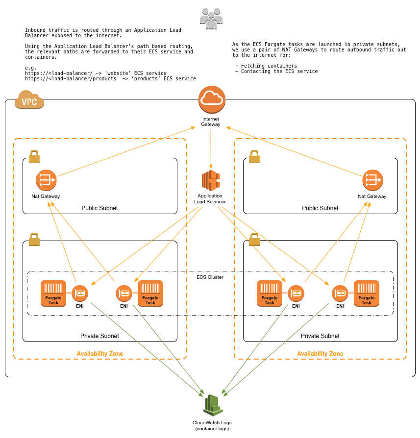
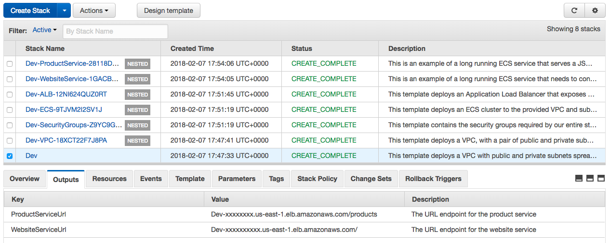

# Deploying Microservices with AWS Fargate, AWS CloudFormation, and an Application Load Balancer

This reference architecture provides a set of YAML templates for deploying micro-services to [Amazon EC2 Container Service (Amazon ECS)](http://docs.aws.amazon.com/AmazonECS/latest/developerguide/Welcome.html) using the [AWS Fargate launchtype](https://docs.aws.amazon.com/AmazonECS/latest/developerguide/ECS_GetStarted.html) with [AWS CloudFormation](https://aws.amazon.com/cloudformation/).

You can launch this CloudFormation stack in your account:

| AWS Region | Short name | |
| -- | -- | -- |
| US East (N. Virginia) | us-east-1 | [](https://console.aws.amazon.com/cloudformation/home?region=us-east-1#/stacks/new?stackName=Production&templateURL=https://s3.amazonaws.com/fargate-refarch-cloudformation/master.yaml) |

## Overviev



The repository consists of a set of nested templates that deploy the following:

 - A tiered [VPC](http://docs.aws.amazon.com/AmazonVPC/latest/UserGuide/VPC_Introduction.html) with public and private subnets, spanning an AWS region.
 - An ECS cluster  that your Fargate tasks will be launched into.
 - A pair of [NAT gateways](http://docs.aws.amazon.com/AmazonVPC/latest/UserGuide/vpc-nat-gateway.html) (one in each AZ) to handle outbound traffic.
 - Two interconnecting micro-services deployed as [ECS services](http://docs.aws.amazon.com/AmazonECS/latest/developerguide/ecs_services.html) (website-service and product-service).
 - An [Application Load Balancer (ALB)](https://aws.amazon.com/elasticloadbalancing/applicationloadbalancer/) to the public subnets to handle inbound traffic.
 - ALB path-based routes for each ECS service to route the inbound traffic to the correct service.
 - Centralized container logging with [Amazon CloudWatch Logs](http://docs.aws.amazon.com/AmazonCloudWatch/latest/logs/WhatIsCloudWatchLogs.html).

## Why use AWS CloudFormation with Amazon ECS?

Using CloudFormation to deploy and manage services with ECS has a number of nice benefits over more traditional methods ([AWS CLI](https://aws.amazon.com/cli), scripting, etc.).

#### Infrastructure-as-Code

A template can be used repeatedly to create identical copies of the same stack (or to use as a foundation to start a new stack).  Templates are simple YAML- or JSON-formatted text files that can be placed under your normal source control mechanisms, stored in private or public locations such as Amazon S3, and exchanged via email. With CloudFormation, you can see exactly which AWS resources make up a stack. You retain full control and have the ability to modify any of the AWS resources created as part of a stack.

#### Self-documenting

Fed up with outdated documentation on your infrastructure or environments? Still keep manual documentation of IP ranges, security group rules, etc.?

With CloudFormation, your template becomes your documentation. Want to see exactly what you have deployed? Just look at your template. If you keep it in source control, then you can also look back at exactly which changes were made and by whom.

#### Intelligent updating & rollback

CloudFormation not only handles the initial deployment of your infrastructure and environments, but it can also manage the whole lifecycle, including future updates. During updates, you have fine-grained control and visibility over how changes are applied, using functionality such as [change sets](https://aws.amazon.com/blogs/aws/new-change-sets-for-aws-cloudformation/), [rolling update policies](http://docs.aws.amazon.com/AWSCloudFormation/latest/UserGuide/aws-attribute-updatepolicy.html) and [stack policies](http://docs.aws.amazon.com/AWSCloudFormation/latest/UserGuide/protect-stack-resources.html).

## Template details

The templates below are included in this repository and reference architecture:

| Template | Description |
| --- | --- |
| [master.yaml](master.yaml) | This is the master template - deploy it to CloudFormation and it deploys all of the others automatically. |
| [infrastructure/vpc.yaml](infrastructure/vpc.yaml) | This template deploys a VPC with a pair of public and private subnets spread across two Availability Zones. It deploys an [Internet gateway](http://docs.aws.amazon.com/AmazonVPC/latest/UserGuide/VPC_Internet_Gateway.html), with a default route on the public subnets. It deploys a pair of NAT gateways (one in each AZ), and default routes for them in the private subnets. |
| [infrastructure/security-groups.yaml](infrastructure/security-groups.yaml) | This template contains the [security groups](http://docs.aws.amazon.com/AmazonVPC/latest/UserGuide/VPC_SecurityGroups.html) required by the entire stack. They are created in a separate nested template so that they can be referenced by all of the other nested templates. |
| [infrastructure/load-balancers.yaml](infrastructure/load-balancers.yaml) | This template deploys an ALB to the public subnets, which exposes the various ECS services. It is created in in a separate nested template so that it can be referenced by all of the other nested templates and so that the various ECS services can register with it. |
| [infrastructure/ecs-cluster.yaml](infrastructure/ecs-cluster.yaml) | This template deploys an ECS cluster and creates an ECS Task Execution IAM Role. |
| [services/product-service/service.yaml](services/product-service/service.yaml) | This is an example of a long-running ECS service that serves a JSON API of products. For the full source for the service, see [services/product-service/src](services/product-service/src).|
| [services/website-service/service.yaml](services/website-service/service.yaml) | This is an example of a long-running ECS service that needs to connect to another service (product-service) via the load-balanced URL. We use an environment variable to pass the product-service URL to the containers. For the full source for this service, see [services/website-service/src](services/website-service/src). |

After the CloudFormation templates have been deployed, the [stack outputs](http://docs.aws.amazon.com/AWSCloudFormation/latest/UserGuide/outputs-section-structure.html) contain a link to the load-balanced URLs for each of the deployed micro-services.



## How do I...?

### Get started and deploy this into my AWS account

You can launch this CloudFormation stack in your account:

| AWS Region | Short name | |
| -- | -- | -- |
| US East (N. Virginia) | us-east-1 | [](https://console.aws.amazon.com/cloudformation/home?region=us-east-1#/stacks/new?stackName=Production&templateURL=https://s3.amazonaws.com/fargate-refarch-cloudformation/master.yaml) |

### Customize the templates

1. [Fork](https://github.com/pjlewisuk/fargate-refarch-cloudformation#fork-destination-box) this GitHub repository.
2. Clone the forked GitHub repository to your local machine.
3. Modify the templates.
4. Upload them to an Amazon S3 bucket of your choice.
5. Either create a new CloudFormation stack by deploying the master.yaml template, or update your existing stack with your version of the templates.

### Create a new ECS service

1. Push your container to a registry somewhere (e.g., [Amazon ECR](https://aws.amazon.com/ecr/)).
2. Copy one of the existing service templates in [services/*](/services).
3. Update the `ContainerName` and `Image` parameters to point to your container image instead of the example container.
4. Increment the `ListenerRule` priority number (no two services can have the same priority number - this is used to order the ALB path based routing rules).
5. Copy one of the existing service definitions in [master.yaml](master.yaml) and point it at your new service template. Specify the HTTP `Path` at which you want the service exposed.
6. Deploy the templates as a new stack, or as an update to an existing stack.

### Setup centralized container logging

By default, the containers in your ECS tasks/services are already configured to send log information to CloudWatch Logs and retain them for 365 days. Within each service's template (in [services/*](services/)), a LogGroup is created that is named after the CloudFormation stack. All container logs are sent to that CloudWatch Logs log group, using a prefix of the form `Stack-Name/Container-Name/ECS-Task-ID`.

You can view the logs by looking in your [CloudWatch Logs console](https://console.aws.amazon.com/cloudwatch/home?#logs:) (make sure you are in the correct AWS region).

ECS Fargate only supports the `awslogs` logging driver, and you can find more information in the [Using the awslogs Log Driver documentation]( https://docs.aws.amazon.com/AmazonECS/latest/developerguide/using_awslogs.html). You can also adjust the log retention period from the default 365 days by tweaking the `RetentionInDays` parameter.

For more information, see the [LogConfiguration](http://docs.aws.amazon.com/AmazonECS/latest/APIReference/API_LogConfiguration.html) API operation.

### Change the CPU or memory allocated to a task
AWS Fargate introduced a new concept known as task-level resources, which allows you to set a ceiling for the total amount of resources a task can consume. This enables Fargate to allocate capacity on your behalf when launching a task. Task-level resources are required parameters for Fargate tasks, and must be defined according to one of the many [supported configurations](https://docs.aws.amazon.com/AWSCloudFormation/latest/UserGuide/aws-resource-ecs-taskdefinition.html#cfn-ecs-taskdefinition-cpu).

These resources are defined in the [master.yaml](master.yaml) templates and can be changed by modifying the `ProductService` or `WebsiteService` sections as illustrated below:

```
ProductService:
    Type: AWS::CloudFormation::Stack
    Properties:
        TemplateURL: ...
        Parameters:
            ...
            TaskCpu: 512 # cpu-units
            TaskMemory: 1024 # megabyes
            ...
```


### Change the CPU or memory allocated to a container within a task
As well as defining compute resources at the task level, you can continue to define these resources at a container level within your tasks. This is useful if you have multiple containers running within your task which require unequal shares of the task-level resources, or if it is more important to allocate resources to some containers relevant to others within a task.

There are three parameters you can define at the container level: [CPU](https://docs.aws.amazon.com/AmazonECS/latest/developerguide/task_definition_parameters.html#cpu), [Memory](https://docs.aws.amazon.com/AmazonECS/latest/developerguide/task_definition_parameters.html#memory), and [MemoryReservation](https://docs.aws.amazon.com/AmazonECS/latest/developerguide/task_definition_parameters.html#memoryReservation). `Cpu` and `MemoryReservation` both set the amount of resource to reserve for the container, so can be used as a way to guarantee container performance. `Memory` sets a hard limit of memory to present to a container.

These resources are defined in the relevant service template (in services/\*/service.yaml) and can be defined using the `Cpu`, `Memory`, and `MemoryReservation` parameters:

```
TaskDefinition:
    Type: AWS::ECS::TaskDefinition
    Properties:
        Family: ...
        ContainerDefinitions:
            - Name: ...
              # CPU and Memory reservations are set to 50% of the default values specified above
              Cpu: 256 # cpu-units
              Memory: 1024 # megabytes
              MemoryReservation: 512 # megabytes
              ...
```

### Deploy multiple environments (e.g., dev, test, pre-production)

Deploy another CloudFormation stack from the same set of templates to create a new environment. The stack name provided when deploying the stack is prefixed to all taggable resources (e.g., EC2 instances, VPCs, etc.) so you can distinguish the different environment resources in the AWS Management Console.

### Change the VPC or subnet IP ranges

This set of templates deploys the following network design:

| Item | CIDR Range | Usable IPs | Description |
| --- | --- | --- | --- |
| VPC | 10.180.0.0/16 | 65,536 | The whole range used for the VPC and all subnets |
| Public Subnet | 10.180.8.0/21 | 2,041 | The public subnet in the first Availability Zone |
| Public Subnet | 10.180.16.0/21 | 2,041 | The public subnet in the second Availability Zone |
| Private Subnet | 10.180.24.0/21 | 2,041 | The private subnet in the first Availability Zone |
| Private Subnet | 10.180.32.0/21 | 2,041 | The private subnet in the second Availability Zone |

You can adjust the CIDR ranges used in this section of the [master.yaml](master.yaml) template:

```
VPC:
  Type: AWS::CloudFormation::Stack
    Properties:
      TemplateURL: !Sub ${TemplateLocation}/infrastructure/vpc.yaml
      Parameters:
        EnvironmentName:    !Ref AWS::StackName
        VpcCIDR:            10.180.0.0/16
        PublicSubnet1CIDR:  10.180.8.0/21
        PublicSubnet2CIDR:  10.180.16.0/21
        PrivateSubnet1CIDR: 10.180.24.0/21
        PrivateSubnet2CIDR: 10.180.32.0/21
```

### Add a new item to this list

If you found yourself wishing this set of frequently asked questions had an answer for a particular problem, please [submit a pull request](https://help.github.com/articles/creating-a-pull-request-from-a-fork/). The chances are that others will also benefit from having the answer listed here.

## Contributing

Please [create a new GitHub issue](https://github.com/pjlewisuk/fargate-refarch-cloudformation/issues/new) for any feature requests, bugs, or documentation improvements.

Where possible, please also [submit a pull request](https://help.github.com/articles/creating-a-pull-request-from-a-fork/) for the change.

## License

Copyright 2011-2018 Amazon.com, Inc. or its affiliates. All Rights Reserved.

Licensed under the Apache License, Version 2.0 (the "License"). You may not use this file except in compliance with the License. A copy of the License is located at

[http://aws.amazon.com/apache2.0/](http://aws.amazon.com/apache2.0/)

or in the "license" file accompanying this file. This file is distributed on an "AS IS" BASIS, WITHOUT WARRANTIES OR CONDITIONS OF ANY KIND, either express or implied. See the License for the specific language governing permissions and limitations under the License.
